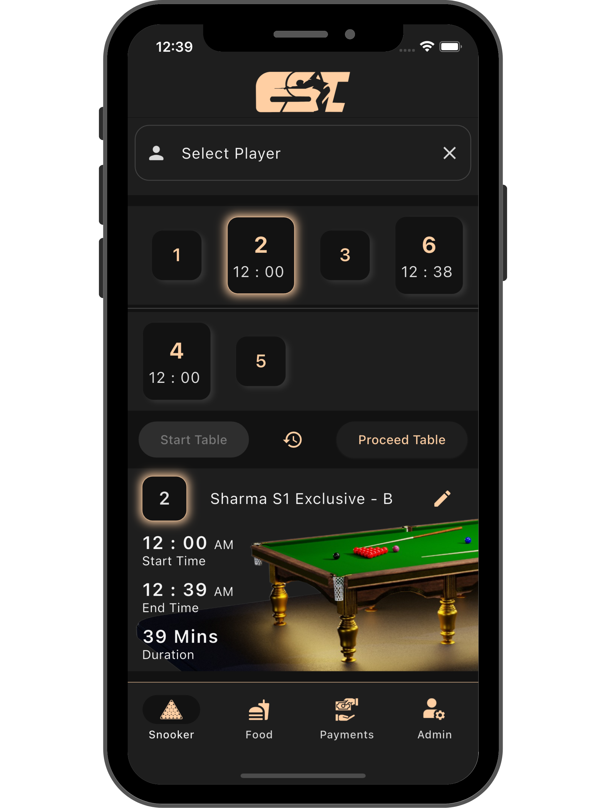
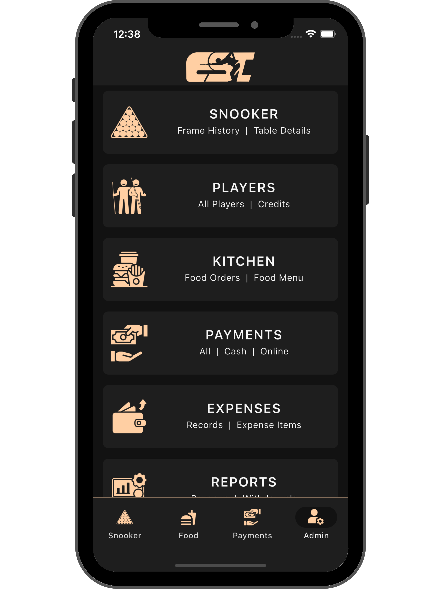
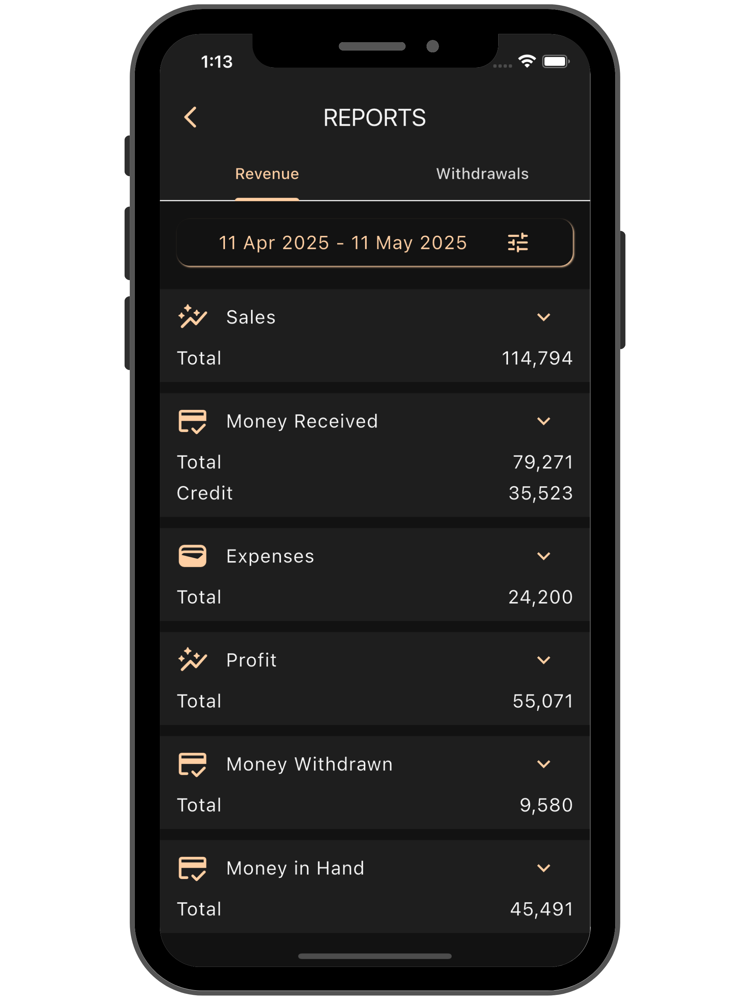
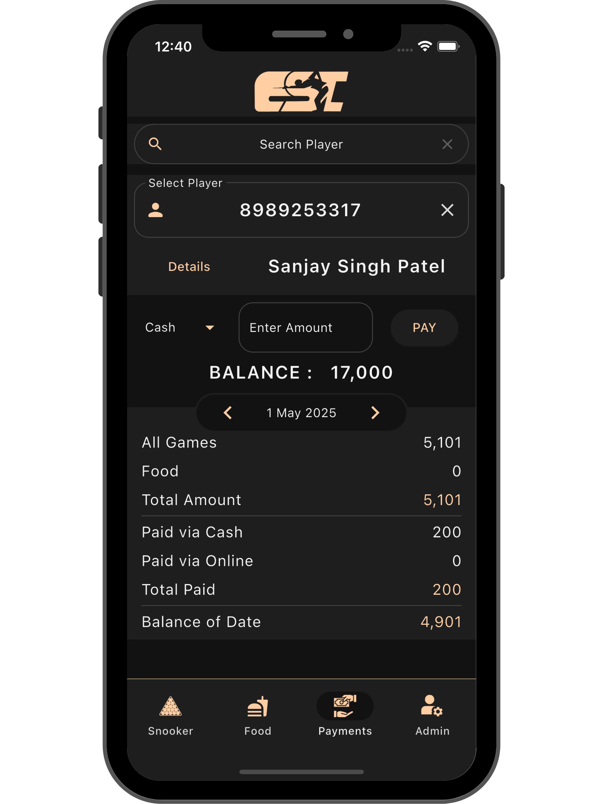
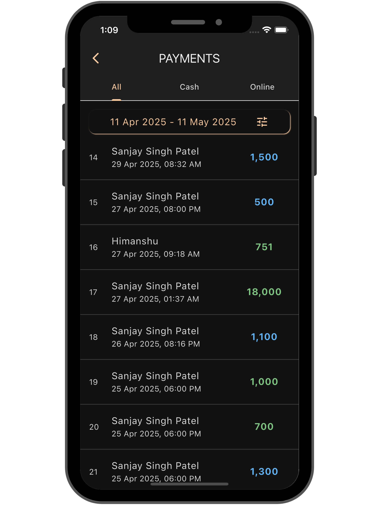
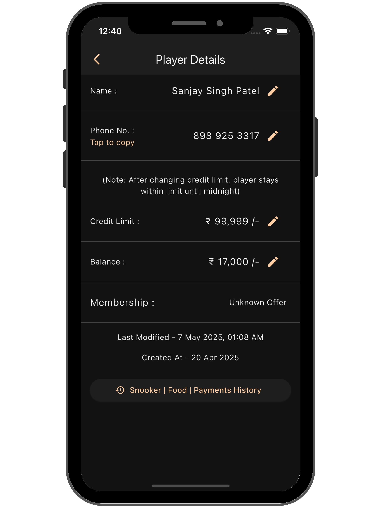
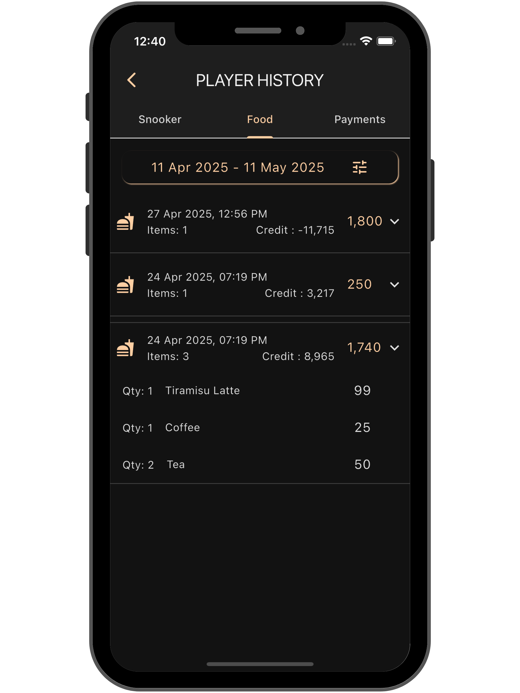
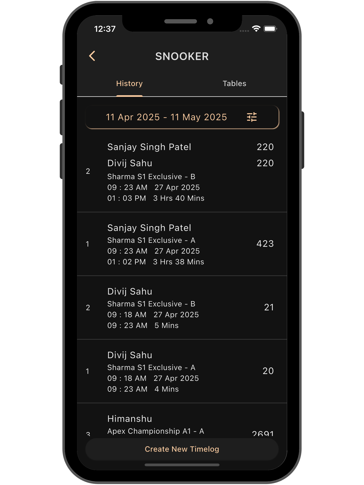

# 🎱 Club Sync India
### _The Complete POS & Management Solution for Snooker Clubs_

**🚀 Empowering Snooker Clubs with Modern Digital Solutions**

*From table management to payment processing, inventory tracking to business analytics - everything you need to run a successful snooker club, all in one powerful mobile-first platform.*

### 📲 Live App Downloads

**✅ Available on Google Play Store** | **🧪 iOS Beta via TestFlight**

> **Note**: This is a portfolio showcase of a proprietary project. The app is live and operational, serving real snooker clubs. Source code is not publicly available due to commercial licensing.

---

## 📱 App Screenshots

### Main Dashboard & Overview

### Core Features Showcase

<table>
<tr>
<td align="center">

 <strong>🎱 Table Management</strong>
 <em>Real-time table monitoring & control</em>
</td>
<td align="center">

 <strong>👥 Player Management</strong>
 <em>Comprehensive player profiles & CRM</em>
</td>
<td align="center">

 <strong>🍽️ Menu & Ordering</strong>
 <em>Mobile-first kitchen operations</em>
</td>
</tr>
</table>

### Business Intelligence & Management

<table>
<tr>
<td align="center">

 <strong>💰 Payment Processing</strong>
 <em>Multi-payment POS system</em>
</td>
<td align="center">

 <strong>📊 Analytics Dashboard</strong>
 <em>Real-time business insights</em>
</td>
<td align="center">

 <strong>🧑‍💼 Staff Management</strong>
 <em>Employee tracking & payroll</em>
</td>
</tr>
</table>

### Advanced Configuration

---

## 📋 Table of Contents

- [🌟 Why Club Sync India?](#-why-club-sync-india)
- [🎯 Core Features](#-core-features)
- [🛠️ Technology Stack](#️-technology-stack)
- [🏗️ Architecture](#️-architecture)
- [📊 Technical Achievements](#-technical-achievements)
- [📈 Business Impact](#-business-impact)
- [🎯 Development Highlights](#-development-highlights)
- [📚 Documentation](#-documentation)
- [📞 Contact](#-contact)

---

## 🌟 Why Club Sync India?

Club Sync India transforms traditional snooker club operations into a streamlined, digital-first experience. Built specifically for snooker clubs and cafés, our platform eliminates manual processes, reduces errors, and provides powerful insights to help your business thrive.

### 💡 **Key Benefits**
- **📈 Increase Revenue**: Smart automation and real-time analytics help identify growth opportunities
- **⚡ Operational Efficiency**: Reduce manual work by 70% with automated table management and billing
- **👥 Enhanced Customer Experience**: Seamless player management and faster service delivery
- **📊 Data-Driven Decisions**: Comprehensive reporting and business intelligence tools
- **🔄 Multi-Platform Access**: Works on mobile, tablet, desktop, and web - access anywhere, anytime

## 🎯 Core Features

### 🎱 **Snooker & Game Management**
- **🎮 Smart Table Control**: Remote on/off control with automatic timers and lighting integration
- **📋 Real-Time Monitoring**: Live table status, availability tracking, and session management
- **⏱️ Precision Billing**: Second-wise automatic billing with comprehensive game logging
- **💡 Auto Lighting**: Tables lights automatically sync with game sessions

### 👥 **Player Management & CRM**
- **👤 Comprehensive Profiles**: Complete player history, contact details, and preferences
- **💳 Advanced Balance System**: Credits, advances, dues with automatic calculations
- **🎫 Membership Tiers**: Customizable plans with exclusive benefits and rewards
- **📊 Player Analytics**: Play patterns, spending insights, and engagement metrics

### 🍽️ **Kitchen & Menu Operations**
- **📱 Mobile-First Ordering**: Take orders from anywhere in the club on any device
- **⚡ Real-Time Kitchen Updates**: Instant order transmission to kitchen staff
- **📦 Smart Inventory**: Stock monitoring with automated low-stock alerts
- **🔄 Dynamic Menu Management**: Update prices, availability, and offers in real-time

### 💰 **Financial Management & POS**
- **💳 Multi-Payment Support**: Cash, UPI, cards, and digital wallet integration
- **📜 Detailed Transaction Logs**: Comprehensive payment history with advanced filtering
- **🧾 Expense Tracking**: Categorized business expense recording and monitoring
- **💼 Cash Management**: Real-time cash-in-hand tracking and withdrawal records

### 📊 **Business Intelligence & Reports**
- **📈 Visual Dashboards**: Real-time business metrics with intuitive charts
- **💹 Revenue Analytics**: Sales breakdown by time, category, payment method
- **👥 Player Behavior**: Understanding customer patterns and preferences
- **⚡ Performance Monitoring**: Peak hours analysis, table utilization, staff efficiency

## 🛠️ Technology Stack

| Category | Technologies |
|----------|-------------|
| **Frontend** | Flutter 3.0+ with Material Design 3 |
| **Language** | Dart 3.0+ |
| **State Management** | Provider Pattern |
| **Networking** | Dio HTTP Client with Connectivity Plus |
| **Storage** | SharedPreferences for local data |
| **UI Components** | Custom widgets with Font Awesome icons |
| **Navigation** | Google Nav Bar with custom routing |
| **Architecture** | Feature-first with layered separation |

### 🌐 **Platform Support**
- ✅ **Android** (API 21+) - Primary platform with full feature support
- ✅ **iOS** (12.0+) - Complete iOS compatibility
- ✅ **Web** - Responsive web interface for desktop access
- ✅ **Windows** - Native desktop application
- ✅ **macOS** - Native macOS support
- ✅ **Linux** - Linux desktop compatibility

## 🏗️ Architecture

### 📐 **Design Philosophy**

Club Sync India follows a **feature-first** and **layered** architecture, ensuring:
- 🎯 **Clear Separation of Concerns**
- 🔧 **High Maintainability** 
- 📈 **Easy Scalability**
- 🧩 **Modular Development**

### 🏛️ **Architecture Principles**

#### **🔄 State Management**
- **Provider Pattern**: Reactive state management across the app
- **Feature-Specific Providers**: Each major feature has dedicated state management
- **Global State**: Shared state managed in global providers
- **Local UI State**: Component-level state for UI interactions

#### **🎯 Code Organization**
- **Feature-First Structure**: Related functionality grouped together
- **Domain-Driven Design**: Business logic separated from UI
- **Dependency Injection**: Services injected through Provider pattern
- **Single Responsibility**: Each class has one clear purpose

## 📊 Technical Achievements

### **🚀 Performance Optimizations**
- Cross-platform development with single codebase
- Real-time data synchronization
- Offline-first architecture with auto-sync
- Multi-environment deployment (Dev/Stage/Prod)
- Efficient state management with minimal rebuilds

### **🎨 UI/UX Excellence**
- Material Design 3 implementation
- Responsive design for all screen sizes
- Intuitive navigation patterns
- Custom business-specific widgets
- Accessibility-compliant interface

### **🔧 Development Best Practices**
- Feature-first architecture
- Comprehensive error handling
- Automated testing strategies
- Clean code principles
- Documentation-driven development

## 📈 Business Impact

### **💼 Operational Excellence**
- **70% reduction** in manual processes
- **Real-time insights** for business decisions
- **Enhanced customer experience** with faster service
- **Streamlined operations** across all departments
- **Multi-branch scalability** for growing businesses

### **📊 Live Deployment Metrics**
- **✅ Production Ready**: Currently deployed and serving real businesses
- **🏪 Active Installations**: Multiple snooker clubs using the platform
- **📱 Google Play Store**: Live on Android with active user base
- **🧪 iOS TestFlight**: Beta testing with club owners and staff
- **🔄 Daily Transactions**: Handles hundreds of real transactions daily
- **⚡ Performance**: Sub-second response times in production
- **🛡️ Reliability**: 99.9% uptime with robust error handling
- **🌐 Cross-Platform**: Proven compatibility across 6 platforms

## 🎯 Development Highlights

This project demonstrates expertise in:

- **Production Flutter Development**: Live app serving real businesses with complex requirements
- **State Management**: Efficient Provider pattern implementation handling real-world data
- **Architecture Design**: Scalable, maintainable code proven in production environment
- **Cross-Platform Deployment**: Successfully deployed on Google Play Store and iOS TestFlight
- **Business Application Development**: Complex POS system handling actual financial transactions
- **UI/UX Design**: Material Design 3 interface validated by real users
- **Performance Optimization**: Production-tested real-time updates and data handling
- **Commercial App Store Deployment**: Experience with app store submission and approval processes

## � Documentation

### 📖 Comprehensive Documentation Available

- **[📱 Screenshots Documentation](docs/SCREENSHOTS.md)**: Detailed explanation of each app screen
- **[🏗️ Architecture Guide](docs/ARCHITECTURE.md)**: Technical architecture and design patterns
- **[🚀 Deployment Guide](docs/DEPLOYMENT.md)**: Multi-platform deployment strategies
- **[📁 Project Structure](docs/PROJECT_STRUCTURE.md)**: Repository organization and conventions
- **[🎯 Features Overview](FEATURES.md)**: Complete feature breakdown
- **[🛠️ Technology Stack](TECH_STACK.md)**: Detailed technology documentation

### 🎯 Portfolio Highlights

This repository demonstrates:
- **Professional Documentation**: Comprehensive project documentation
- **Visual Showcase**: High-quality app screenshots with detailed explanations
- **Technical Depth**: Advanced architecture and deployment strategies
- **Business Focus**: Real-world application with measurable business impact
- **Modern Practices**: Current industry best practices and standards

## �📞 Contact

For inquiries about this project or collaboration opportunities:

- 📧 **Email**: divijsahu@gmail.com
- 💼 **LinkedIn**: https://www.linkedin.com/in/divij-sahu-flutter-dev/
- 🐙 **GitHub**: https://github.com/divijsahu
- 🌐 **Portfolio**: Coming Soon

---

### 🎱 **Professional Flutter Development Showcase**

**Transforming Business Operations Through Mobile Technology**

*This portfolio project demonstrates advanced Flutter development capabilities and business application expertise.*

